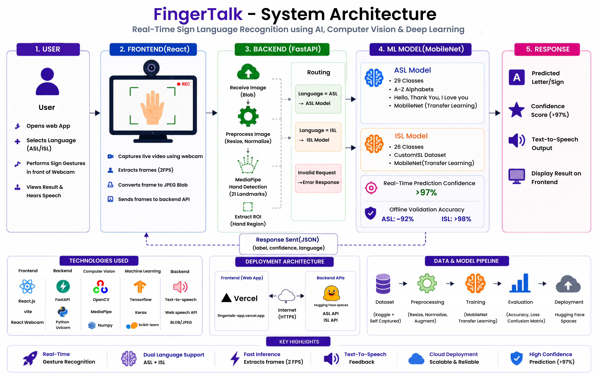
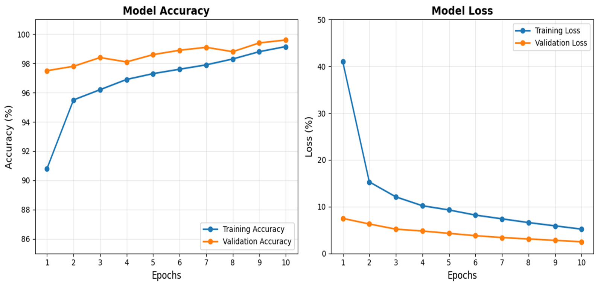

# 🤟 FingerTalk – AI-Powered Sign Language Recognition System

### Breaking Communication Barriers Through AI, Computer Vision & Deep Learning

---

## 🌐 Live Deployments

### 🚀 Web Application

🔗 https://fingertalk-app.vercel.app

---

# 📌 About FingerTalk

FingerTalk is a real-time AI-powered sign language recognition platform designed to bridge the communication gap between hearing/speech-impaired individuals and non-signers.

The platform supports:

- 🇺🇸 American Sign Language (ASL)
- 🇮🇳 Indian Sign Language (ISL)

and converts sign gestures into:

✅ Text

✅ Speech

✅ Real-time predictions

---

# 🚀 Project Journey

What started as a small demo project during our third semester gradually evolved into a research publication and later into our final-year mega project.

Over the course of two years, FingerTalk expanded from a basic proof of concept into a complete AI-powered web platform featuring:

- Real-time gesture recognition
- Cloud-deployed ML APIs
- Dual-language support (ASL + ISL)
- Text-to-speech integration
- Modern frontend and backend architecture

---

# ✨ Features

- 🎥 Real-time webcam gesture detection
- 🧠 Deep-learning-based sign classification
- ✋ MediaPipe hand landmark extraction
- 🔊 Text-to-speech output
- ☁️ Cloud-deployed ML APIs
- 📱 Responsive web interface
- ⚡ Low-latency predictions
- 🌎 Dual-language support (ASL & ISL)

---

# 🏗️ System Architecture

  

---

# 📸 Application Demo

  

---

# 📊 Model Performance

## Accuracy & Loss Curves

  

## Confusion Matrix

  

---

# 🧠 ML Model Details

## 🇺🇸 ASL Model

### Classes

- A–Z alphabets
- Hello
- Thank You
- I Love You

### Performance

- Training Accuracy: 99%+
- Validation Accuracy (Offline): ~91–92%
- Optimized for real-time inference

---

## 🇮🇳 ISL Model

### Classes

- A–Z alphabets

### Performance

- Training Accuracy: 99%+
- Validation Accuracy (Offline): ~98%
- Stable low-latency inference

---

## ☁️ Backend Services

FingerTalk uses independently deployed machine-learning APIs hosted on Hugging Face Spaces.

- https://huggingface.co/spaces/Viraj1923/FingerTalk_American_SL_Backend_Version_2
- https://huggingface.co/spaces/Viraj1923/FingerTalk_Indian_SL_Backend

The React frontend communicates with these services through REST APIs for real-time predictions.

# ⚠️ Real-World Challenges

One of the biggest lessons we learned while building FingerTalk was that training an AI model is only one part of the problem.

Real-world deployment introduces several challenges:

- Different lighting conditions
- Webcam quality variations
- Gesture differences between users
- Background noise
- Real-time inference constraints
- Model generalization

Although the reported metrics were obtained under controlled testing conditions, real-world performance may vary.

---

# 🛠️ Tech Stack

## Frontend

- React.js
- Vite
- React Webcam
- CSS

## Backend

- FastAPI
- Python
- Uvicorn

## Machine Learning

- TensorFlow / Keras
- MediaPipe
- OpenCV
- NumPy
- Scikit-learn

## Deployment

- Vercel
- Hugging Face Spaces

---

# 📅 Project Timeline

📌 **2024**

- Initial demo project

📌 **2025**

- Research paper submission

📌 **2026**

- Final-year mega project expansion

📌 **2026**

- Cloud deployment and optimization

---

# 👨‍💻 Team

| Member | Role |
|----------|----------|
| Viraj Mulik | Backend & Model Integration |
| Onkar Giri | Model Creation & Integration |
| Viraj Patole | Frontend Development |
| Harshvardhan Killedar | Documentation Head |
| Digvijay Pawar | Documentation & Testing |

---

# 🎯 Future Scope

- Sentence generation
- Dynamic gesture recognition
- Edge AI optimization
- Support for additional sign languages

---

# 📄 Research Publication

Our research paper:

**"FingerTalk: Revolutionizing Communication with a Machine Learning Breakthrough in Sign Language Recognition"**

was published in **Procedia Computer Science (Elsevier)**.

📄 https://www.sciencedirect.com/science/article/pii/S1877050926014031

---

# 📜 License

Licensed under the MIT License.

---

# ⭐ Support

If you found this project interesting, consider giving it a star ⭐
